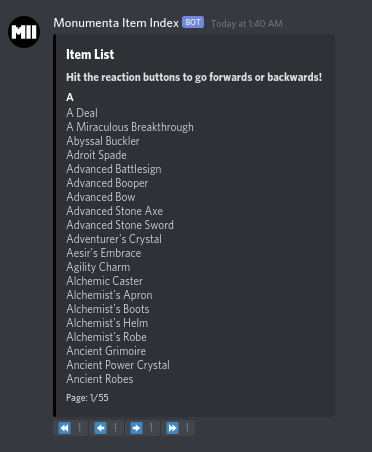

# DiscordBook

A Discord module for bot developers wanting a lightweight and customizable package for a book-like info display.

Example of a well-formatted book display:



### Terminology:
* ***Book*** - abstracted structure to use
* ***Line*** - particular item inside the book - in the above example, "Abyssal Buckler" would be a line
* ***Chapter*** - group of lines - in the example, "A" would be a chapter
* ***Page*** - combination of chapter headers and lines that can be displayed on the embed


### Options
Currently, 2 types of books are supported - a default book with the following default parameters:
```python
Book(chapters = [], title = "\a", description = '\a', color = 1, per_page = 10)
```

And an alphabetically ordered book with the following default parameters:
```python
AlphabeticalBook(content = [], title = "\a", description = '\a', color = 1, per_page = 10, ignore_caps = True)
```

### Example usage of Alphabetical Book:
```python
from discordbook import AlphabeticalBook

# Creating the content for the book
lines1 = ["Test", "test", "Abc", "bc", "D", "Zee"]

# Initializing the object itself
a_book = AlphabeticalBook(lines1, "Test Book", "test desc", ignore_caps = False)

# A blocking method that will send and constantly update the book display
await a_book.open_book(client, message.channel)
```

#### Result


### Caveats
- Books are static once generated
- Opening a book should be the last call in your function, since it will prevent the rest of your code from running
- Creating a book with empty lines will result in errors

### TODO:
- [ ] Develop ordering of chapters based of less than function?
- [ ] Bookmark feature to come back to this page after?
- [ ] Give more fine-grained control with non-blocking books
- [ ] Better error checking on small/empty books
- [ ] Set browsing speed, better options for settings
- [ ] Better documentation


Open to pull requests or issues!